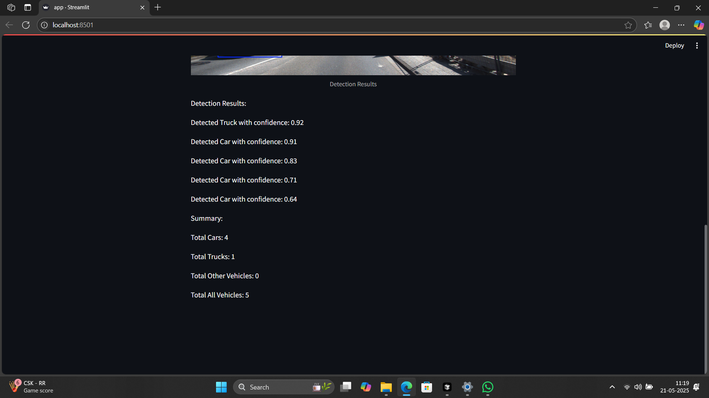
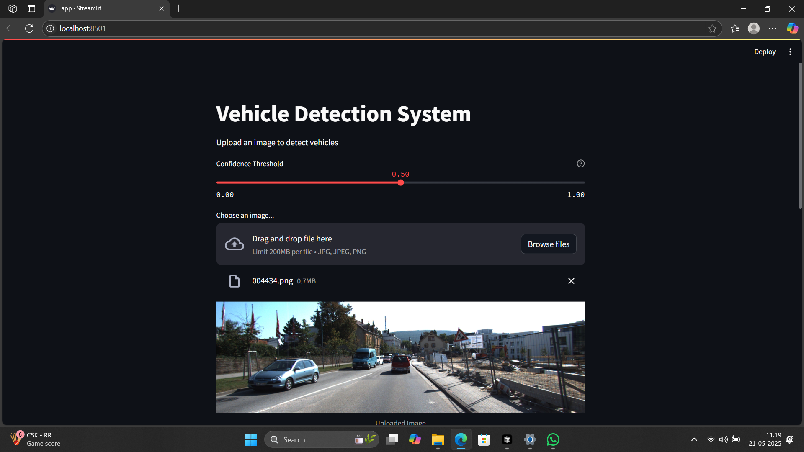
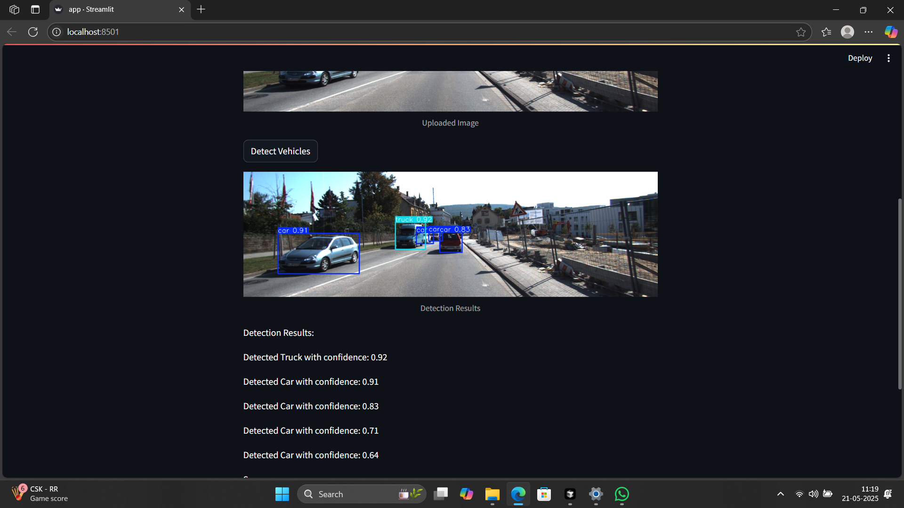

# Vehicle Detection System

A real-time vehicle detection system using YOLOv5 and Streamlit for a user-friendly interface.

## Screenshots

### Detection Results


### User Interface


### Training Progress


## Setup Instructions

### Prerequisites
- Python 3.8 or higher
- CUDA-capable GPU (recommended)
- Git

### Installation Steps

1. Clone the repository:
```bash
git clone [repository-url]
cd vehicle-detection-system
```

2. Create and activate virtual environment:
```bash
# Windows
python -m venv venv
.\venv\Scripts\activate

# Linux/Mac
python -m venv venv
source venv/bin/activate
```

3. Install dependencies:
```bash
pip install -r requirements.txt
```

4. Download YOLOv5:
```bash
git clone https://github.com/ultralytics/yolov5
cd yolov5
pip install -r requirements.txt
cd ..
```

### Dataset Preparation

1. Place your dataset in the project root directory. The expected structure is a folder named `trafic_data` containing `train` and `valid` subdirectories, each with `images` and `labels` folders.

2. Run the label conversion script to convert original labels to YOLO format with the correct class mapping:
```bash
python convert_labels.py
```

### Running the Application

1. Train the YOLOv5 model:
```bash
python yolov5/train.py --img 480 --batch 24 --epochs 30 --data data/dataset.yaml --weights yolov5/yolov5n.pt --workers 4 --cache
```
(You can adjust parameters like `--epochs` and `--batch` as needed)

2. Start the Streamlit app:
```bash
streamlit run app.py
```

3. Open your browser and navigate to the provided local URL (usually `http://localhost:8501`).

4. Upload an image and adjust the confidence threshold for detection.

## Model Choice and Approach

### Why YOLOv5?
- **Speed**: Real-time detection capabilities
- **Accuracy**: State-of-the-art object detection
- **Efficiency**: Lightweight model (YOLOv5n) for faster processing
- **Flexibility**: Easy to train and fine-tune

### Model Architecture
- Base Model: YOLOv5n (nano)
- Input Size: 480x480 pixels
- Classes: 
  - Car
  - Truck
  - Bus
  - Ambulance
  - Motorbike
  - Bicycle
- Training Parameters:
  - Batch Size: 24
  - Epochs: 30
  - Learning Rate: Adaptive
  - Optimizer: SGD with momentum

### Detection Approach
1. Image Preprocessing:
   - Resize to 480x480
   - Normalize pixel values
   - Convert to tensor format

2. Feature Extraction:
   - Convolutional layers
   - Feature pyramid network
   - Multi-scale detection

3. Post-processing:
   - Non-maximum suppression
   - Confidence thresholding
   - Bounding box refinement

## Limitations and Assumptions

### Technical Limitations
1. **Performance**:
   - CPU-only mode is slower
   - Minimum 4GB RAM required
   - GPU recommended for real-time detection

2. **Detection Accuracy**:
   - Works best with clear, well-lit images
   - May struggle with:
     - Extreme weather conditions
     - Poor lighting
     - Occluded vehicles
     - Very small vehicles

3. **Image Requirements**:
   - Minimum resolution: 480x480 pixels
   - Supported formats: JPG, JPEG, PNG
   - Maximum file size: 10MB

### Assumptions
1. **Vehicle Types**:
   - Trained to detect: Car, Truck, Bus, Ambulance, Motorbike, Bicycle
   - Assumes vehicles are reasonably visible

2. **Environment**:
   - Standard road/street scenes
   - Moderate to good lighting conditions
   - Vehicles are not heavily occluded

3. **Usage**:
   - Single image processing
   - Static images (not video)
   - User can adjust confidence threshold

## Observations and Notes

### Performance Metrics
(Training metrics will be updated after training completion)

### Known Issues
- Initial training attempts encountered issues with incorrect class IDs in labels, resolved by cleaning the conversion script and updating dataset paths.
- Performance may be limited on systems without a dedicated GPU.

### Future Improvements
1. **Model Enhancements**:
   - Improve small object detection
   - Better handling of occlusions

2. **Features**:
   - Video processing support
   - Real-time tracking
   - Multiple model options

## Project Structure
```
vehicle-detection-system/
├── app.py                 # Streamlit application
├── data/
│   ├── dataset.yaml      # Dataset configuration
│   ├── images/           # Training and validation images (copied from trafic_data)
│   └── labels/           # Converted training and validation labels
├── yolov5/               # YOLOv5 framework
├── requirements.txt      # Project dependencies
├── convert_labels.py      # Script to convert original labels to YOLO format
├── .gitignore            # Specifies intentionally untracked files
└── README.md            # This file
```

## Contributing
Contributions are welcome! Please feel free to submit a Pull Request.

## License
This project is licensed under the MIT License - see the LICENSE file for details.

 